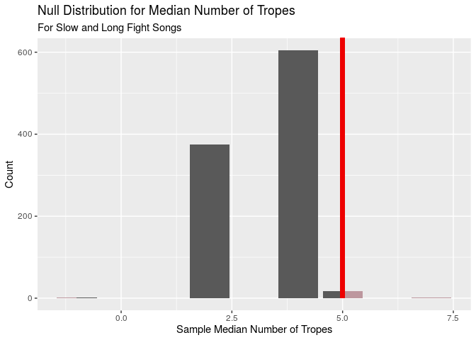

Data Analysis
================
Power Ninja Data Turtles
12.03.2019

### Load data and packages

``` r
library(tidyverse)
library(infer)
library(broom)

fight_songs <- read_csv("/cloud/project/data/fight-songs.csv")
fight_songs <- fight_songs %>%
  select(-X21)
```

### Research Question 1

Our first research question is:

> "How does the tempo (`bpm`) and duration (`sec_duration`) of a college
> football team’s fight song predict the content of the song,
> specifically the number of clichés/tropes (`trope_count`)?

Before we delve deeper into our analysis, let’s first take a look at the
distributions of our two explanatory variables, `bpm` and
`sec_duration`.

Starting with `bpm`, which is a measure of a fight song’s tempo, we will
create a histogram and find the relevant summary statistics:

``` r
ggplot(fight_songs, mapping = aes(x = bpm)) +
  geom_histogram(binwidth = 10) +
  labs(title = "Tempo of College Fight Songs", x = "Beats per Minute (bpm)", y = "Number of Songs")
```

<!-- -->

Let’s also calculate the summary statistics for this distribution.
Specifically, we will use the median as a measure of center and the
interquartile range as a measure of spread (due to the bimodal nature of
the distribution). In addition, we will find the upper and lower
quartiles (Q3 and Q1, respectively), and the maximum and minimum values:

``` r
fight_songs %>%
  summarise(min = min(bpm), Q1 = quantile(bpm, .25), median = median(bpm), Q3 = quantile(bpm, .75), max = max(bpm), IQR = IQR(bpm))
```

    ## # A tibble: 1 x 6
    ##     min    Q1 median    Q3   max   IQR
    ##   <dbl> <dbl>  <dbl> <dbl> <dbl> <dbl>
    ## 1    65    90    140   151   180    61

Based on the histogram, it is clear that the shape of the data is
clearly bimodal, with two distinct peaks occurring around 70 bpm and
around 150 bpm, with a split in the data at around 100 bpm. There are
more songs that are clustered around the higher bpm mode. The center
(median) occurs at 140 bpm, and the spread (IQR) is 61 bpm, indicating
that there is a moderate amount of variability in tempos. There are no
outliers in this distribution. Due to the bimodal result, it seems like
there is a natural grouping between “slow” songs and “fast” songs, so we
will mutate our data set to add a new variable, `tempo`, which is “slow”
if a song’s bpm is less than 100 bpm, “fast” if a song’s tempo is
greater than 100 bpm.

``` r
fight_songs <- fight_songs %>%
  mutate(tempo = case_when(
    bpm <= 100 ~ "slow",
    bpm > 100 ~ "fast"
  ))
```

Now, let’s start exploring our second explanatory variable,
`sec_duration`, which is the duration of a song in seconds. In order to
do this, we will create a histogram of the distribution and find the
relevant summary statistics.

``` r
ggplot(fight_songs, mapping = aes(x = sec_duration)) +
  geom_histogram(binwidth = 20) +
  labs(title = "Duration of College Fight Songs", x = "Duration (s)", y = "Number of Songs")
```

<!-- -->

``` r
fight_songs %>%
  summarise(min = min(sec_duration), Q1 = quantile(sec_duration, .25), median = median(sec_duration), Q3 = quantile(sec_duration, .75), max = max(sec_duration), IQR = IQR(sec_duration))
```

    ## # A tibble: 1 x 6
    ##     min    Q1 median    Q3   max   IQR
    ##   <dbl> <dbl>  <dbl> <dbl> <dbl> <dbl>
    ## 1    27    58     67    85   172    27

Based on the histogram, we can see that the distribution of fight song
durations is roughly symmetric (slightly skewed to the right) and
unimodal, with a peak at around 70. There are some outliers on the
higher end of the spectrum (`sec_duration` \> 125.5), indicating that
these songs are significantly longer than the others. The center of the
distribution occurs at around 67 seconds, and the IQR of the
distribution is 27 seconds, which is relatively narrow, indicating that
fight songs do not have dramatically different lengths. Like we did with
`bpm`, let’s add a new variable, `length`, which is “short” if a song is
less than or equal to the median of 67 seconds, “long” if a song is
greater than the median of 67 seconds.

``` r
fight_songs <- fight_songs %>%
  mutate(length = case_when(
    sec_duration <= 67 ~ "short",
    sec_duration > 67 ~ "long"
  ))
```

Now that we have an understanding of our two explanatory variables, we
want to add a new variable, `classify`, which combines `bpm` and
`sec_duration` by labeling each song with one of four classifications:
“slow and short”, “slow and long”, “fast and short”, and “fast and
long”.

``` r
fight_songs <- fight_songs %>%
  mutate(classify = case_when(
    tempo == "slow" & length == "short" ~ "slow and short",
    tempo == "slow" & length == "long" ~ "slow and long",
    tempo == "fast" & length == "short" ~ "fast and short",
    tempo == "fast" & length == "long" ~ "fast and long",
  ))

fight_songs %>%
  count(classify)
```

    ## # A tibble: 4 x 2
    ##   classify           n
    ##   <chr>          <int>
    ## 1 fast and long     23
    ## 2 fast and short    25
    ## 3 slow and long      9
    ## 4 slow and short     8

Finally, let’s get an understanding of our response variable,
`trope_count`, which is a measure of the number of clichés/tropes in a
given fight song. We will also use a histogram and summary statistics
for this univariate analysis.

``` r
ggplot(fight_songs, mapping = aes(x = trope_count)) +
  geom_histogram(binwidth = 1) +
  labs(title = "Number of Clichés in College Fight Songs", x = "Number of Clichés", y = "Number of Songs")
```

<!-- -->

``` r
fight_songs %>%
  summarise(min = min(trope_count), Q1 = quantile(trope_count, .25), median = median(trope_count), Q3 = quantile(trope_count, .75), max = max(trope_count), IQR = IQR(trope_count))
```

    ## # A tibble: 1 x 6
    ##     min    Q1 median    Q3   max   IQR
    ##   <dbl> <dbl>  <dbl> <dbl> <dbl> <dbl>
    ## 1     0     3      4     5     8     2

Based on the histogram and summary statistics, we can see that the
distribution for number of tropes is unimodal with a peak at around 4
and skewed slightly to the left. There is 1 outlier at the maximum value
of our distribution (8 tropes). The center of the distribution is at
around 4 tropes, and the IQR of 2 indicates that there is not a large
amount of variability in the number of tropes for college fight songs.

Now, let’s return to our research question by seeing whether the amount
of clichés varies based on a song’s classification. First, we will
create violin plots for the distribution of the number of tropes for
each classification.

``` r
ggplot(fight_songs, mapping = aes(x = classify, y = trope_count)) +
  geom_violin(draw_quantiles = c(.25, .5, .75)) +
  geom_jitter() +
  labs(title = "Number of Clichés", subtitle = "by Song Classification", x = "Song Classification", y = "Number of Clichés")
```

<!-- -->

``` r
fight_songs %>%
  group_by(classify) %>%
  summarize(median = median(trope_count), IQR = IQR(trope_count))
```

    ## # A tibble: 4 x 3
    ##   classify       median   IQR
    ##   <chr>           <dbl> <dbl>
    ## 1 fast and long       4   2.5
    ## 2 fast and short      4   1  
    ## 3 slow and long       5   2  
    ## 4 slow and short      4   2

Not surprisingly, all of the distributions, except for “slow and long”,
are all centered at 4 tropes, which is thie median number of tropes for
all songs in the data set. However, there is one classification, “slow
and long,” which has a median of 5. We would like to check whether this
median is statistically significant or not. To do this, we will conduct
a hypothesis test for the median number of tropes for songs that are
considered “slow and long”. Our null hypothesis is that the true median
number of tropes for “slow and long” songs is 4, H0: median(“slow and
long”) = 4. Our alternative hypothesis is that the true median number of
tropes is different than 4, Ha: median(“slow and long”) ≠ 4. We will use
an alpha level of 0.05. Let’s create and visualize the null distribution
and calculate the respective p-value.

``` r
slow_long <- fight_songs %>%
  filter(classify == "slow and long")

set.seed(11101962)
null_slow_long <- slow_long %>%
  specify(response = trope_count) %>%
  hypothesize(null = "point", med = 4) %>%
  generate(reps = 1000, type = "bootstrap") %>%
  calculate(stat = "median")

get_p_value(null_slow_long, obs_stat = 5, direction = "both")
```

    ## # A tibble: 1 x 1
    ##   p_value
    ##     <dbl>
    ## 1   0.038

``` r
visualise(null_slow_long) + 
  labs(title = "Null Distribution for Median Number of Tropes",
       subtitle = "for songs that are slow and long",
       x = "Sample Median Number of Tropes",
       y = "Count") +
  shade_p_value(5, "both")
```

<!-- -->

Based on our p-value of 0.038, which is less than alpha = 0.05, we
reject the null hypothesis. There is convincing evidence that the median
number of tropes for songs that are slow and long is different than the
population average of 4. However, our sample size is very small (9
observations), so we must be wary of our results.

Now, let’s find the full linear model that predicts number of tropes
(`trope_count`) from tempo (`bpm`) and duration (`sec_duration`). We can
also check whether there the coefficients for `bpm` and `sec_duration`
are statistically significant by finding their respective p-values and
using an alpha level of 0.05. Let our null hypotheses be that the slopes
associated with both variables are 0, H0: beta(`bpm`) = 0 and
beta(`sec_duration`) = 0. Let our alternative hypotheses be that the
slopes associated with both variables are significantly different than
0, Ha: beta(`bpm`) ≠ 0 and beta(\`sec\_duration) ≠ 0.

``` r
(m_full <- lm(trope_count ~ bpm + sec_duration, fight_songs)) %>%
  tidy()
```

    ## # A tibble: 3 x 5
    ##   term          estimate std.error statistic  p.value
    ##   <chr>            <dbl>     <dbl>     <dbl>    <dbl>
    ## 1 (Intercept)   4.58       1.11       4.13   0.000109
    ## 2 bpm          -0.00757    0.00640   -1.18   0.241   
    ## 3 sec_duration  0.000208   0.00846    0.0246 0.980

``` r
glance(m_full)$AIC
```

    ## [1] 256.96

``` r
glance(m_full)$r.squared
```

    ## [1] 0.02260804

Based on the output, the full linear model is `trope_count`-hat = 4.58 -
0.00757 \* `bpm` + 0.000208 \* `sec_duration`. The R-squared value is
0.022608, which means that approximately 2.2608044% of the variability
in trope counts can be explained by the linear model that predicts trope
count from a song’s tempo and duration. Given this R-squared model, our
model is very weak.

The intercept tells us that for a song with 0 bpm and that is 0 seconds
long, the expected number of tropes is 4.58 (this is nonsensical, as
there is no such thing as a song that is 0 bpm or 0 minutes). The
intercept of -0.00757 for `bpm` tells us that for an increase in 1 bpm,
the number of tropes is expected to decrease by 0.00757. The intercept
of 0.000208 for `sec_duration` tells us that for an increase in a song’s
duration by 1 second, the number of tropes is expected to increase by
0.000208. However, the p-values for the coefficients of `bpm` and
`sec_duration`, 0.241 and 0.980. respectively, are both greater than our
alpha level of 0.05. Therefore, we fail to reject the null hypothesis.
There is insufficient evidence that the coefficients for `bpm` and
`sec_duration` are different than 0.

Circling back to our research question, we now have evidence that our
two explanatory variables, `bpm` and `sec_duration`, do not seem to have
any correlation to the trope count for a given fight song.

In order to make sure that there is no better model, we will use the
`step()` function and use backwards selection with AIC as the selection
criterion.

``` r
(m_trope_count <- step(m_full, direction = "backward")) %>%
  tidy() %>%
  select(term, estimate)
```

    ## Start:  AIC=70.5
    ## trope_count ~ bpm + sec_duration
    ## 
    ##                Df Sum of Sq    RSS    AIC
    ## - sec_duration  1    0.0017 175.33 68.499
    ## - bpm           1    3.9608 179.29 69.950
    ## <none>                      175.33 70.498
    ## 
    ## Step:  AIC=68.5
    ## trope_count ~ bpm
    ## 
    ##        Df Sum of Sq    RSS    AIC
    ## - bpm   1    4.0538 179.38 67.984
    ## <none>              175.33 68.499
    ## 
    ## Step:  AIC=67.98
    ## trope_count ~ 1

    ## # A tibble: 1 x 2
    ##   term        estimate
    ##   <chr>          <dbl>
    ## 1 (Intercept)     3.62

``` r
glance(m_trope_count)$AIC
```

    ## [1] 254.4464

``` r
glance(m_trope_count)$r.squared
```

    ## [1] 0

Since backwards selection removed both `bpm` and `sec_duration` from our
model, we can conclude that these two variables are insignificant and
are not valid predictors for the number of tropes in a college fight
song.
