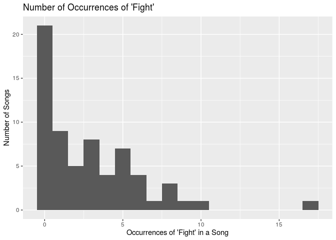
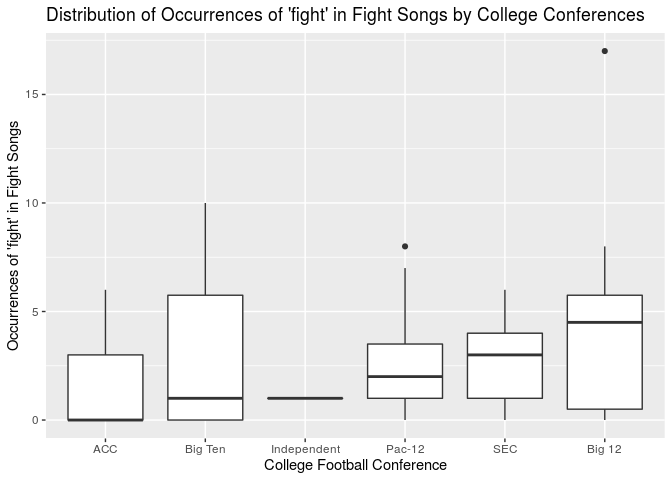

Analyzing College Fight Songs
================
Power Ninja Data Turtles
10/25/19

### Section 1: Introduction

In our research project, we will be analyzing the fight songs of various
college football teams to discover the patterns
(similarities/differences) between them. More specifically, we will be
examining the fight songs of all 65 teams located across the Power 5
sports conferences (Big 10, Big 12, ACC, Pac-12 and SEC). Our dataset,
which is fittingly titled `fight-songs`, is a part of the
fivethirtyeight package in R. Each observation in the set represents a
distinct Power 5 college football team. For each team (observation), the
dataset features 23 variables (of which we are using 19, plus one of our
own, for a total of 20), which contain a wide range of information,
primarily concerning the school’s fight song.

The variables are as follows: `school`, `conference`, `song_name`,
`writers`, `year`, `student_writer`, `official_song`, `bpm`,
`sec_duration`, `fight`, `number_fights`, `victory_win_won`, `rah`,
`nonsense`, `colors`, `men`, `opponents`, `spelling`, `trope_count`, and
finally, `rank`. Detailed explanations of each variable are located in
the codebook.

The data was collected by looking at the lyrics of each song (as
published by the school), metadata about each fight song on Spotify,
history about each song (as stated by the school), and information about
each school’s conference, which is easily accessible on the Internet. We
added the `rank` variable to the dataset using Microsoft Excel, and we
found this information from the Associated Press’s historic rankings of
every college football team in the country, which was released last
year.

By means of our analysis, we hope to determine if any characteristics of
fight songs (duration, number of tropes, etc.) are exclusive to
particular college football conferences, or rather if songs have
universal traits across the entire set of observations (all 65 colleges
considered). We will utilize the `rank` variable to form connections
between the performances of certain college football teams and their
respective fight songs. For example, we may be better equipped to
formulate conclusions about the similarities in the fight songs of
higher-ranked (more successful) teams due to the addition of this new
variable.

### Section 2: Exploratory Data Analysis

We are interested in determining whether the number of times a fight
song contains the word “fight” varies based on conference. Depending on
the number of times this word appears, we can predict whether a
particular conference is more or less aggressive than another
conference. First, let’s analyze the variable `number_fights`, which
counts the number of times “fight” appears in the fight song for each
team. A histogram displaying the number of occurrences of this word is
shown below:

``` r
ggplot(data = fight_songs, mapping = aes(x = number_fights)) + 
  geom_histogram(binwidth = 1) + 
  labs(x = "Occurrences of 'fight' in Fight Songs", y = "Number of Songs", title = "Number of Occurrences of 'fight'")
```

<!-- -->

Let’s also calculate the summary statistics for this distribution.
Specifically, we will use the median as a measure of center and the
interquartile range as a measure of spread (due to the skewness of the
distribution). In addition, we will find the upper and lower quartiles
(Q3 and Q1 respectively), and the maximum and minimum values:

``` r
fight_songs %>%
  summarise(median = median(number_fights), 
            IQR = IQR(number_fights), 
            Q1 = quantile(number_fights, 0.25), 
            Q3 = quantile(number_fights, 0.75), 
            min = min(number_fights), 
            max = max(number_fights))
```

    ## # A tibble: 1 x 6
    ##   median   IQR    Q1    Q3   min   max
    ##    <dbl> <dbl> <dbl> <dbl> <dbl> <dbl>
    ## 1      2     5     0     5     0    17

Based on the histogram, the shape of the distribution is clearly skewed
to the right, implying that there are more songs that say “fight” only a
few times compared to those that say “fight” multiple times. The
distribution is clearly unimodal with one distinct peak located at x = 0
(zero occurrences of ‘fight’). The center (median) of the distribution
occurs x = 2 (‘fight’ appears twice), indicating that at least 50% of
the songs contain 2 or less occurrences of this word. The data is fairly
spread out, as indicated by an IQR of 5 and a range (maximum value minus
minimum value) of 17. There are 2 outliers, which are the songs in which
‘fight’ appears at least 12.5 times (obviously, a word cannot occur at
half-integer frequencies, so the songs must contain this word at least
13 times to move beyond Q3 + 1.5 \* IQR).

Next, let’s analyze the distribution of the number of times a song says
“fight,” for each conference. The box plot of `number_fights` by
`conference` is
below:

``` r
  ggplot(data = fight_songs, mapping = aes(y = number_fights, x = fct_reorder(factor(conference), number_fights))) +
  geom_boxplot() +
  #geom_jitter(position=position_jitter(0.2)) +
  labs(x = "College Football Conference", y = "Occurrences of 'fight' in Fight Songs",
       title = "Distribution of Occurrences of 'fight' in Fight Songs by College Conferences")
```

<!-- -->

Let’s also get the summary statistics for each distribution. In
particular, we will use the median as a measure of center and IQR as a
measure of spread. In addition, we will find the maximum and the
minimum.

``` r
fight_songs %>%
  group_by(factor(conference)) %>%
  summarise(median = median(number_fights), 
            iqr = IQR(number_fights), 
            min = min(number_fights), 
            max = max(number_fights)) %>%
  arrange(median)
```

    ## # A tibble: 6 x 5
    ##   `factor(conference)` median   iqr   min   max
    ##   <fct>                 <dbl> <dbl> <dbl> <dbl>
    ## 1 ACC                     0    3        0     6
    ## 2 Big Ten                 1    5.75     0    10
    ## 3 Independent             1    0        1     1
    ## 4 Pac-12                  2    2.5      0     8
    ## 5 SEC                     3    3        0     6
    ## 6 Big 12                  4.5  5.25     0    17

Based on the boxplots, the number of times that a fight song contains
the word “fight” varies based on conference. The conferences with the
highest median occurences of “fight” are Big 12 and then SEC while the
conferences with the lowest median occurences of “fight” are the ACC and
then Big Ten.

### Section 3: Research Questions

### Section 4: Data

Below, we use the glimpse() function to display a preview of the dataset
`fight_songs`:

``` r
glimpse(fight_songs)
```

    ## Observations: 65
    ## Variables: 20
    ## $ school          <chr> "Notre Dame", "Baylor", "Iowa State", "Kansas", …
    ## $ conference      <chr> "Independent", "Big 12", "Big 12", "Big 12", "Bi…
    ## $ song_name       <chr> "Victory March", "Old Fight", "Iowa State Fights…
    ## $ writers         <chr> "Michael J. Shea and John F. Shea", "Dick Baker …
    ## $ year            <chr> "1908", "1947", "1930", "1912", "1927", "1905", …
    ## $ student_writer  <chr> "No", "Yes", "Yes", "Yes", "Yes", "Yes", "No", "…
    ## $ official_song   <chr> "Yes", "Yes", "Yes", "Yes", "Yes", "Yes", "Yes",…
    ## $ bpm             <dbl> 152, 76, 155, 137, 80, 153, 180, 81, 149, 159, 1…
    ## $ sec_duration    <dbl> 64, 99, 55, 62, 67, 37, 29, 65, 47, 54, 92, 60, …
    ## $ fight           <chr> "Yes", "Yes", "Yes", "No", "Yes", "No", "Yes", "…
    ## $ number_fights   <dbl> 1, 4, 5, 0, 6, 0, 5, 17, 2, 8, 0, 0, 1, 9, 8, 0,…
    ## $ victory_win_won <chr> "Yes", "Yes", "No", "No", "Yes", "No", "Yes", "Y…
    ## $ rah             <chr> "Yes", "No", "Yes", "No", "No", "Yes", "No", "No…
    ## $ nonsense        <chr> "No", "No", "No", "Yes", "No", "No", "No", "No",…
    ## $ colors          <chr> "Yes", "Yes", "No", "No", "Yes", "No", "No", "Ye…
    ## $ men             <chr> "Yes", "No", "Yes", "Yes", "No", "No", "Yes", "N…
    ## $ opponents       <chr> "No", "No", "No", "Yes", "No", "No", "Yes", "Yes…
    ## $ spelling        <chr> "No", "Yes", "Yes", "No", "No", "Yes", "No", "No…
    ## $ trope_count     <dbl> 6, 5, 4, 3, 3, 2, 4, 4, 6, 3, 1, 6, 3, 3, 3, 0, …
    ## $ rank            <dbl> 5, 48, 120, 64, 50, 1, 46, 7, 28, 63, 40, 48, 76…
