Rah\! Fight\! Win\!: Analyzing the Nonsensical Nature of College Fight
Songs
================
Power Ninja Data Turtles
12/13/19

### Introduction

In our research project, we will be analyzing the fight songs of various
college football teams to discover whether a song’s tempo or duration
can tell us anything about the content of the song and whether a team’s
fight song is indicative of its college football program’s success. As
students at one of the most historically spirited and athletically
sucessful colleges in the US, we were interested in analyzing the
connection between school spirit and athletic performance.

More specifically, we will be examining the fight songs of all 64 teams
located across the Power Five sports conferences (Big 10, Big 12, ACC,
Pac-12 and SEC) plus Notre Dame (Independent). Hence, our dataset, which
is fittingly titled `fight-songs`, includes 65 observations. Each
observation in the set represents a distinct Power Five college football
team (or Notre Dame). For each team (observation), the original dataset
featured 23 variables. However, we include 19 of these original
variables, plus one of our own, for a total of 20 in the `fight-songs`
dataset. The variables primarily contain information regarding the
school’s fight song, as well as a couple of characteristics of the
college football teams themselves (i.e. which conference they belong to
or a team’s historic AP ranking).

The variables most pertinent to our analysis are: `conference` (school
football conference), `bpm` (beats per minute), `sec_duration` (duration
of fight song in seconds), `victory_win_won` (whether a song says
“victory,” “win,” or “won”), `men` (whether a song mentions male
groups), `rah` (whether a song include “rah”), `nonsense` (whether a
song includes nonsense syllables, such as “Hooperay”), `opponents`
(whether a song mentions its opponent), `trope_count` (total number of
tropes), and finally `rank`.

The data was collected by looking at the lyrics of each song (as
published by each individual college), metadata about each fight song on
Spotify, history about each song (as stated by the college), and
information about each school’s conference, which is easily accessible
on the Internet. We added the `rank` variable to the dataset using
Microsoft Excel, and we found this information from the Associated
Press’s historic rankings of every college football team in the
country, which was released last year.

As as note, some schools may have more than one fight song and some of
the songs sanctioned as “official” by their schools are not the ones
that fans most commonly chant. The songs that seemed best-known and
best-loved were chosen as the “official” fight song (which characterizes
our observations). Additionally, `fivethirtyeight` has tailored the
lyrics of certain fight songs to those sung most regularly and published
by the school. Thus, some verses will not appear (and hence will not be
considered in our analysis).

We were interested in looking at the content of college fight songs and
the relationship between fight songs and their respective football
team’s performance. After evaluating the variables in the dataset, we
thought it was logical that a song’s content might be influenced by its
tempo and duration. Moreover, the different attributes of fight songs
might be linked to a team’s ranking.

This leads us to our two main research questions. First, how does the
tempo and duration of a college football team’s fight song predict the
content of the song, specifically the number of clichés/tropes? We will
utilize the `trope_count` variable, which counts the number of clichés
in a fight song (since we define a cliché as whether a song contains the
word “fight”, the word “victory”, the word “won”, the word “win”, the
word “rah”, nonsense syllables, its spelling, male groups, or an
opponent name), to form connections between a song’s duration and tempo
and its content. Thus, we aim to describe the relationship, if any
exists, between the numerical predictor (X) variables, `bpm` and
`sec_duration` and the numerical response (Y) variable, `trope_count`.

Our second research question is: how do characteristics of the fight
songs of college football teams correspond to their respective
historical levels of success (rankings)? We will utilize the `rank`
variable to form connections between the performances of college
football teams and their respective fight songs. We aim to describe the
relationship, if any exists, between the categorical predictor (X)
variables, `victory_win_won`, `opponents`, `nonsense`, and `rah`, and
the numerical response (Y) variable, `rank`.

Finally, we will compare the characteristics of fight songs in northern
and southern athletic conferences in the `Additional Analysis` section.

### Description of Statistical Methods

For our data analysis, we used a combination of hypothesis tests and a
variety of plots (from the `ggplot` package) in order to visualize and
interpret each question.

We used hypothesis tests because finding the p-value for each instance
allowed us to conclude whether or not the data provided convincing
evidence of a trend, such as the relationship between the tempo and
content of songs. Our hypothesis tests were conducted using simulation
instead of the Central Limit Theorem (CLT). The CLT was not a valid
option, as none of the subsets of the dataset had at least 30
observations and the majority of our tests are for independence
(difference between two groups). As a result, simulation was the best
alternative for hypothesis testing.

Visualizing the relationships between the explanatory and response
variables with plots made it easy for viewers to understand how the
level or frequency of certain variables changed based on differing
factors between songs. We tried to use unique but clearly structured and
labeled plot formats that would display information in a visually
appealing way without confusing the
viewer.

### Research Question 1: Predicting the Content of College Fight Songs Using Tempo and Duration

Our first research question is:

> “How does the tempo and duration of a college football team’s fight
> song predict the content of the song, specifically the number of
> clichés/tropes?”

Before delving deeper into the analysis, we will first look at the
distributions of the two explanatory variables, `bpm` and
`sec_duration`.

Starting with `bpm`, which is a measure of a fight song’s tempo, we will
create a histogram of the distribution:

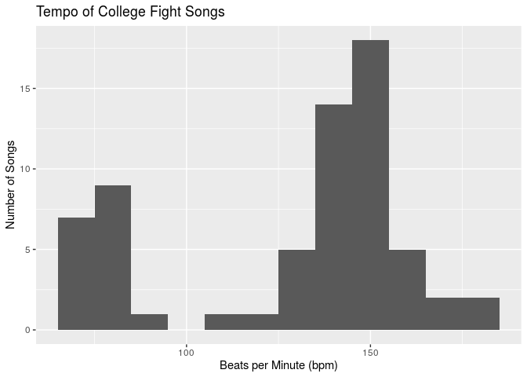<!-- -->

We will also calculate the summary statistics for this distribution.
Specifically, we will use the median as a measure of center and the
interquartile range as a measure of spread (due to the bimodal nature of
the distribution). In addition, we will find the upper and lower
quartiles (Q3 and Q1, respectively), and the maximum and minimum values:

    ## # A tibble: 1 x 6
    ##     min    Q1 median    Q3   max   IQR
    ##   <dbl> <dbl>  <dbl> <dbl> <dbl> <dbl>
    ## 1    65    90    140   151   180    61

Based on the histogram, it is clear that the shape of the data is
clearly bimodal, with two distinct peaks occurring around 70 bpm and
around 150 bpm, with a split in the data at around 100 bpm. There are
more songs that are clustered around the higher bpm mode. The center
(median) occurs at 140 bpm, and the spread (IQR) is 61 bpm, indicating
that there is a moderate amount of variability in tempos. There are no
outliers in this distribution. Due to the bimodal result, it seems like
there is a natural grouping between “slow” songs and “fast” songs, so we
will use the `mutate()` function to add a new variable, `tempo`, which
is “slow” if a song’s `bpm` is less than or equal to 100 bpm and “fast”
if a song’s tempo is greater than 100 bpm.

Now, we will explore our second explanatory variable, `sec_duration`,
which is the duration of a song in seconds. In order to do this, we will
create a histogram of the distribution and find the relevant summary
statistics (Q1, median, Q3, min, max,
IQR):

<!-- -->

    ## # A tibble: 1 x 6
    ##     min    Q1 median    Q3   max   IQR
    ##   <dbl> <dbl>  <dbl> <dbl> <dbl> <dbl>
    ## 1    27    58     67    85   172    27

Based on the histogram, we can see that the distribution of fight song
durations is roughly symmetric (slightly skewed to the right) and
unimodal, with a peak at around 70. There are some outliers on the
higher end of the spectrum (`sec_duration` \> 125.5), indicating that
these songs are significantly longer than the others. The center of the
distribution occurs at around 67 seconds, and the IQR of the
distribution is 27 seconds, which is relatively narrow, indicating that
fight songs do not have dramatically different lengths. Like we did with
`bpm`, we will add a new variable, `length`, which is “short” if a song
is less than or equal to the median of 67 seconds and “long” if a song
is greater than the median of 67 seconds.

Now that we have a better understanding of our two explanatory
variables, we want to add a new variable, `classify`, which combines
`bpm` and `sec_duration` by labeling each song with one of four
classifications: “slow and short”, “slow and long”, “fast and short”,
and “fast and long”:

    ## # A tibble: 4 x 2
    ##   classify           n
    ##   <chr>          <int>
    ## 1 fast and long     23
    ## 2 fast and short    25
    ## 3 slow and long      9
    ## 4 slow and short     8

Based on the output displayed in the tibble above, 23 songs are
categorized as “fast and long”, 25 songs are categorized as “fast and
short”, 9 songs are categorized as “slow and long”, and 8 songs are
categorized as “slow and short”.

Using these classifications, we will visualize the groups and fill in
each observation with the number of tropes associated with that
particular observation. We choose to use `geom_hline()` and
`geom_vline()` to add horizontal and vertical reference lines to the
jittered plot (`geom_jitter()` adds a small amount of random variation
to the location of each point). We also choose to use
`scale_color_gradientn()` to create a rainbow-colored gradient scale,
which indicates the number of tropes for a given fight song.

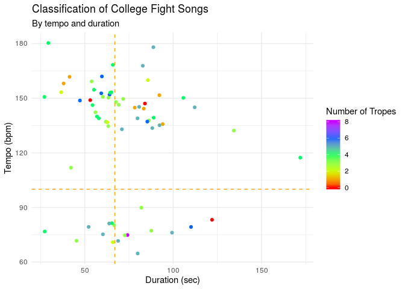<!-- -->

The upper left-hand region of the plot represents songs that are “fast
and short” while the lower left-hand region represents songs that are
“slow and short.” The upper right-hand region of the plot represents
songs that are “fast and long”, and the lower right-hand region
represents songs that are “slow and long”.

Finally, we will explore our response variable, `trope_count`, which is
a measure of the number of clichés/tropes in a given fight song. We will
also use a histogram and summary statistics for this univariate
analysis:

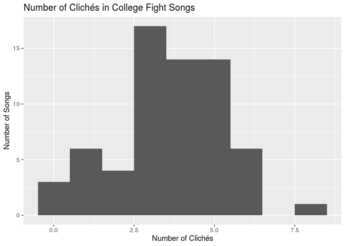<!-- -->

    ## # A tibble: 1 x 7
    ##     min    Q1 median    Q3   max   IQR    sd
    ##   <dbl> <dbl>  <dbl> <dbl> <dbl> <dbl> <dbl>
    ## 1     0     3      4     5     8     2  1.67

Based on the histogram and summary statistics, we can see that the
distribution for number of tropes is unimodal with a peak at around 4
and skewed slightly to the left. There is 1 outlier at the maximum value
of our distribution (8 tropes). The center of the distribution,
described by the median, is 4 tropes, and the IQR of 2 indicates that
there is not a large amount of variability in the number of tropes for
college fight songs.

Now, we will return to our research question by examining whether the
amount of clichés varies based on a song’s classification. First, we
will create violin plots for the distribution of the number of tropes
for each classification and add jitter. Using jittered points allows us
to manage the effects of overplotting when working with smaller
datasets. We were inspired to use this type of plot after conferencing
with Dr. Eric Monson who delivered the “Tips for Effective Data
Visualization” presentation earlier this
semester.

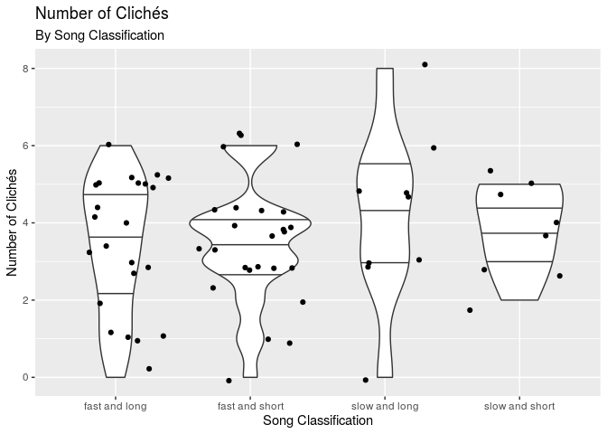<!-- -->

    ## # A tibble: 4 x 4
    ##   classify       median   IQR    sd
    ##   <chr>           <dbl> <dbl> <dbl>
    ## 1 fast and long       4   2.5  1.73
    ## 2 fast and short      4   1    1.56
    ## 3 slow and long       5   2    2.28
    ## 4 slow and short      4   2    1.13

Not surprisingly, all of the distributions, except for “slow and long”,
are centered at 4 tropes, which is the median number of tropes for all
songs in the dataset. However, there is one category, “slow and long,”
which has a median of 5. We would like to check whether this median is
statistically significant or not. To do this, we will conduct a
hypothesis test for the median number of tropes for songs that are
considered “slow and long”. Our null hypothesis is that the true median
number of tropes for “slow and long” songs is 4, H0: median(“slow and
long”) = 4. Our alternative hypothesis is that the true median number of
tropes is different than 4, Ha: median(“slow and long”) ≠ 4. We will use
a significance (alpha) level of 0.05. We will create and visualize the
null distribution and calculate the associated p-value:

    ## # A tibble: 1 x 1
    ##   p_value
    ##     <dbl>
    ## 1   0.038

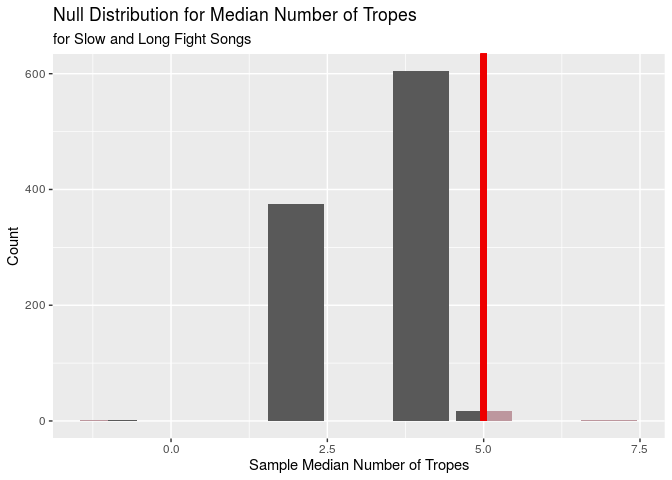<!-- -->

Based on our p-value of 0.038, which is less than 0.05 (significance
level), we reject the null hypothesis in favor of the alternative
hypothesis; in other words, there is sufficient evidence that the true
median number of tropes is different than 4. Thus, the data provide
convincing evidence that the median number of tropes for songs that are
slow and long is different than the population median of 4. However, our
sample size is very small (9 observations), so we must be wary of our
results and acknowledge the limitations of our conclusions.

We can also see from the visualization “Number of Clichés” that the
spread for “slow and short” songs is much smaller compared to all other
song classifications. We will test whether the standard deviation for
“slow and short” songs is significantly different from the population
standard deviation of 1.675. The null hypothesis is that the true
standard deviation in the number of tropes for “slow and short” songs is
1.675, H0: sigma = 1.675. The alternative hypothesis is that the true
standard deviation in the number of tropes for “slow and short” songs is
less than 1.675, Ha: sigma \< 1.675. We will use a significance level of
0.05.

    ## # A tibble: 1 x 1
    ##   p_value
    ##     <dbl>
    ## 1   0.685

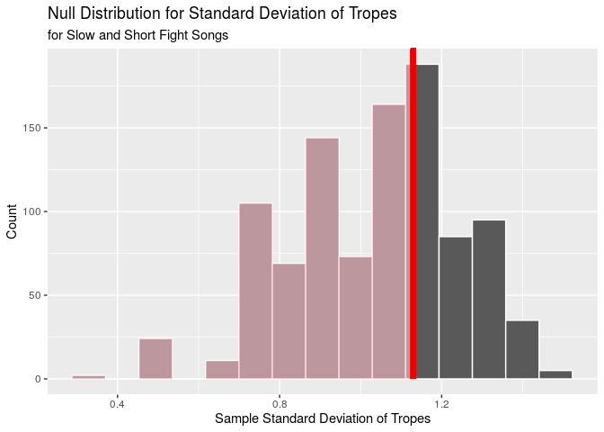<!-- -->

Based on the p-value of 0.685, which is greater than our alpha level of
0.05, we fail to reject the null hypothesis in favor of the alternative
hypothesis; in other words, the data do not provide convincing evidence
that the true standard deviation for slow and short songs is less than
the population standard deviation of 1.675.

Now, we will find the full linear model that predicts number of tropes
(`trope_count`) from tempo (`bpm`) and duration (`sec_duration`):

    ## # A tibble: 3 x 2
    ##   term          estimate
    ##   <chr>            <dbl>
    ## 1 (Intercept)   4.58    
    ## 2 bpm          -0.00757 
    ## 3 sec_duration  0.000208

Based on the output, the full linear model is `trope_count-hat` = 4.58 -
0.00757 \* `bpm` + 0.000208 \* `sec_duration`. The R-squared value is
0.022608, which means that approximately 2.2608044% of the variability
in trope counts can be explained by the linear model that predicts trope
count from a song’s tempo and duration. Given this R-squared value, our
model is very weak, since, in general, the closer the R-squared value is
to 1 (100% of the variability in trope counts can be explained by the
model), the more accurate and useful the final model is. As the model
only accounts for a small percent of the variability in trope counts, it
is not a great predictor of a fight song’s trope count.

The intercept tells us that for a song with 0 bpm which lasts 0 seconds,
the expected number of tropes is 4.58. But of course, this is
nonsensical, since none of the fight songs we are considering in our
analysis last 0 seconds (for that matter, no songs, by definition, last
0 seconds\!). The slope coefficient associated with `bpm` tells us that
for an increase in 1 bpm, the number of tropes is expected, on average,
to decrease by 0.00757, holding all else constant. The slope coefficient
associated with `sec_duration` tells us that for an increase in a song’s
duration by 1 second, the number of tropes is expected, on average, to
increase by 0.000208, holding all else constant.

Now, we will conduct a hypothesis test for the slopes to determine
whether the slope coefficients for `bpm` and `sec_duration` are
significantly different from 0. We will use a significance level of
0.05. Conducting a hypothesis test for the slopes will help us confirm
or deny our research question on whether either tempo or duration are
useful predictors of the content of a fight song, as determined by a
song’s number of tropes.

Let our null hypotheses be that the slope coefficients associated with
both variables are 0; H0: beta(`bpm`) = 0 and beta(`sec_duration`) = 0.
Let our alternative hypotheses be that the slope coefficients associated
with both variables are significantly different than 0, Ha: beta(`bpm`)
≠ 0 and beta(`sec_duration`) ≠ 0.

First, we will look at the slope of `bpm`, which we found to be 0.00757:

    ## # A tibble: 1 x 1
    ##   p_value
    ##     <dbl>
    ## 1   0.238

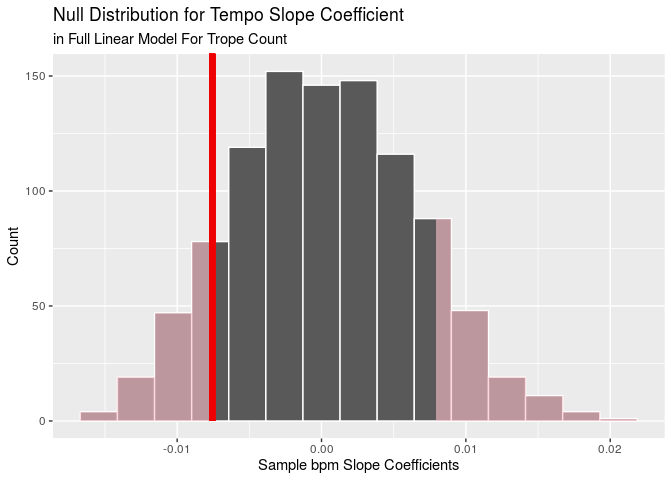<!-- -->

Next, we will look at the slope of `tempo`, which we found to be
0.000208:

    ## # A tibble: 1 x 1
    ##   p_value
    ##     <dbl>
    ## 1   0.978

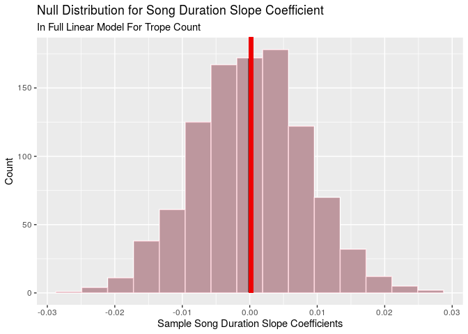<!-- -->

The p-values for the slope coefficients of `bpm` and `sec_duration` are
0.238 and 0.978, respectively. Since both p-values are greater than our
alpha level of 0.05, we fail to reject the null hypotheses in favor of
the alternative hypotheses. Hence, there appears to be insufficient
evidence that the slope coefficients for `bpm` and `sec_duration` are
different than 0.

However, we must must verify that the four conditions for inference for
regression are satisfied before finalizing any conclusions: (1)
observations should be independent; (2) residuals should be randomly
distributed around 0; (3) residuals should be nearly normally
distributed, centered at 0; (4) residuals should have constant variance.

First, we can assume that the observations (fight songs) are independent
because college fight songs are unique to every team and written by
different authors. We will verify our assumption (confirm independence
of observations) by plotting the residuals in the order of data
collection:

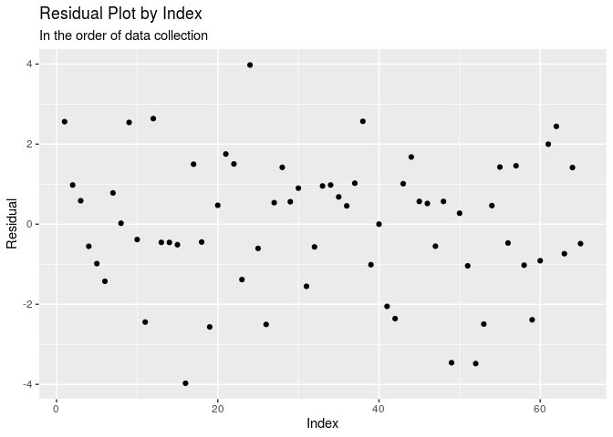<!-- -->

Next, we will examine the normality of residuals:

<!-- -->

Finally, we will check the distribution of residuals around 0 and
constant variance:

<!-- -->

Clearly, condition 4 (constant variance) is violated. As one moves from
left to right, the middle section gets more narrow, as seen by the two
points. Also, it appears that the points are on a negative slant. Both
of these factors violate constant variance. Therefore, inference for
regression is invalid. This means our conclusion that there is
insufficient evidence to suggest the slope coefficients for `bpm` and
`sec_duration` are different than 0 is also not credible.

To confirm that there is no better linear model, we will use the
`step()` function and backwards selection with AIC as the selection
criterion:

    ## # A tibble: 1 x 2
    ##   term        estimate
    ##   <chr>          <dbl>
    ## 1 (Intercept)     3.62

Since backwards selection removed both `bpm` and `sec_duration` from our
model, we should conclude that these two variables are not valid
predictors for the number of tropes in a college fight song.

However, we must consider one last element before concluding that `bpm`
and `sec_duration` are poor predictors of `trope_count`: whether the
requirements for linear regression are satisfied. Amongst other things,
a linear model mandates a continuous numerical response variable\! But,
it is clear that `trope_count` does not fulfill this criterion since it
is a counting (discrete) numerical response variable. Thus, our final
conclusions are as follows: this method of analysis involving linear
regression is invalid and there is no guarantee that the explanatory
variables are poor predictors of the response variable.

### Conclusion from Research Question 1

Circling back to our research question of whether a fight song’s tempo
and duration can help predict the content of a college fight song, as
measured by the number of clichés, we hypothesized that the number of
clichés would be less for songs with slower tempos (smaller `bpm`) and
probably shorter durations (smaller `sec_duration`). We thought that
longer songs would contain more clichés because there is more time to
fill the lyrics with clichés. We thought that faster tempos, since they
are generally related to higher energies, would have included more
clichés.

From our exploratory data analysis, we noticed that there was a natural
grouping in fight songs such that all fight songs could be classified as
having a slow or fast tempo. With this information and with the results
from exploring the duration variable, we decided to classify all fight
songs into four categories: “short and fast,” “short and slow,” “long
and fast,” and “long and slow.”

After creating a violin plot for each classification and its respective
distribution of the number of tropes, we noticed two things. First,
“slow and long” songs had a greater median number of tropes. Second,
“slow and short” songs had a smaller variation in the number of
tropes. From here, we decided to conduct a hypothesis test to confirm or
deny whether what we observed in the violin plots was statistically
significant. It turned out that “slow and long” songs in our dataset
did, in fact, have median number of tropes that was different than the
the population median of 4 (p = 0.038). However, the small spread of the
distribution of “slow and short” songs proved not to be different from
the population standard deviation of 1.67 (p = 0.685).

We then looked at the linear model between `bpm` and `sec_duration`, the
explanatory variables, and `trope_count` to see whether `bpm` and
`sec_duration` were, indeed, good predictors of the number of tropes in
a college fight song. The original model had an R-squared value of
0.022608, which indicated that the model was very weak. After conducting
hypothesis tests for the slope of `sec_duration` and `bpm`, we found
that neither slope was significantly different than 0 (p = 0.238 and p =
0.978, respectively). However, after checking the conditions of
inference for regression, we found that the residuals did not have
constant variance; therefore, our inference for regression is invalid,
and our conclusion that there is insufficient evidence to suggest the
slope coefficients for `bpm` and `sec_duration` are different than 0 is
not credible.

Finally, we used backwards selection using AIC as the criterion to see
if there was a particularly better linear model. However, backwards
selection removed both of our explanatory variables, `bpm` and
`sec_duration`, which indicated to us that these two variables are not
valid predictors for the number of tropes in a college fight song.
Therefore, the answer to our research question is that neither tempo nor
duration can predict the content of a college fight song. The only thing
we can say is that “slow and long” fight songs have a different median
number of tropes than other fight
songs.

## Research Question 2: Predicting the Success of College Football Teams Using Fight Song Content

Our second research question is:

> “How do characteristics of the fight songs of college football teams
> correspond to their respective historical levels of success
> (rankings)?”

Before delving deeper into the analysis, we will first look at the
distributions of the four explanatory variables, `victory_win_won`,
`opponents`, `nonsense`, and `rah`, and our response variable, `rank`.

Starting with `victory_win_won`, which designates whether a fight song
says “victory”, “win”, or “won”, we will create a segmented bar plot for
the distribution:

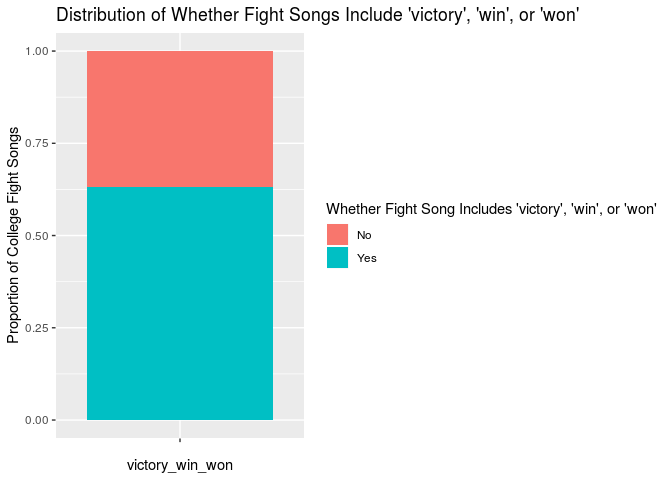<!-- -->

    ## # A tibble: 2 x 2
    ##   victory_win_won rel_freq
    ##   <chr>              <dbl>
    ## 1 No                 0.369
    ## 2 Yes                0.631

Based on the output displayed above, approximately 63.1% of college
fight songs include “victory”/“win”/“won”, whereas 36.9% do not.

Next, we will explore `opponents`, which designates whether a song
mentions an opponent, by creating a segmented bar plot:

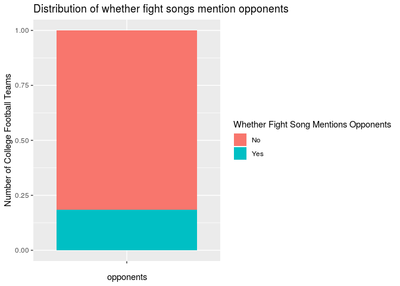<!-- -->

    ## # A tibble: 2 x 2
    ##   opponents rel_freq
    ##   <chr>        <dbl>
    ## 1 No           0.815
    ## 2 Yes          0.185

Based on the output displayed above, approximately 81.5% of college
fight songs do not mention opponents, whereas 18.5% do.

Now, we will examine `nonsense`, which designates whether a song
includes any nonsense words/phrases, by creating a segmented bar plot:

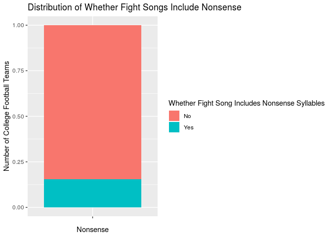<!-- -->

    ## # A tibble: 2 x 2
    ##   nonsense rel_freq
    ##   <chr>       <dbl>
    ## 1 No          0.846
    ## 2 Yes         0.154

Based on the output displayed above, approximately 84.6% of college
fight songs do not contain nonsense syllables, whereas 15.4% do.

Next, we will explore `rah`, which designates whether a fight song says
the word “rah”, by creating a segmented bar plot:

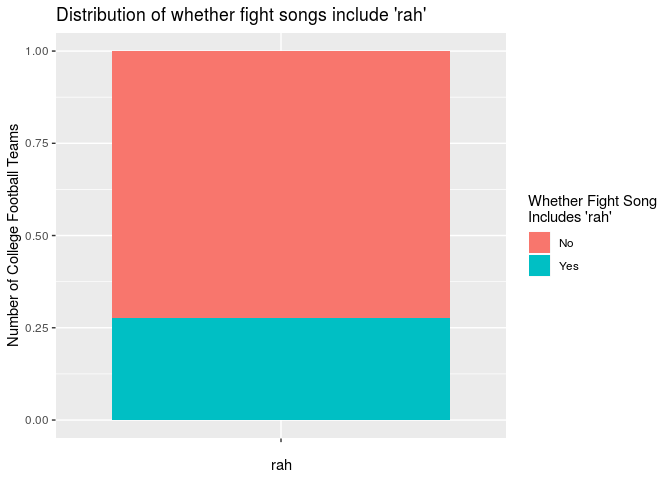<!-- -->

    ## # A tibble: 2 x 2
    ##   rah   rel_freq
    ##   <chr>    <dbl>
    ## 1 No       0.723
    ## 2 Yes      0.277

Based on the output displayed above, approximately 72.3% of college
fight songs do not mention “rah”, whereas 27.7% do.

Finally, we will look at `rank`, which corresponds to the team’s AP
college football ranking. We will create a histogram and calculate the
appropriate summary statistics (Q1, median, Q3, min, max, and IQR):

<!-- -->

    ## # A tibble: 1 x 6
    ##     min    Q1 median    Q3   max   IQR
    ##   <dbl> <dbl>  <dbl> <dbl> <dbl> <dbl>
    ## 1     1    17     34    55   120    38

Based on the histogram, it is clear that the shape of the data is
unimodal. The distribution is skewed to the right, with more colleges
having higher ranked teams than lower ranked teams. The center (median)
occurs at 34, and the spread (IQR) is 38, indicating that there is a
moderate amount of variability in rankings. There is one outlier (a
college football team ranked higher than 112) with a rank of 120.

While we have framed `rank` as a numerical variable, it is actually
categorical. Therefore, in order to provide a more accurate analysis, we
will create a new variable called `rank_level` in order to split the
colleges into high and low rank. Colleges with a rank between 1-25,
inclusive, will be designated as “high” in accordance with college
football’s standards, and all others will be designated as “low.” We
will visualize `rank_level` using a boxplot.

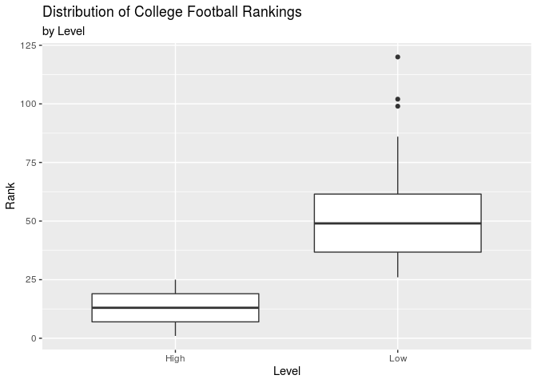<!-- -->

    ## # A tibble: 2 x 2
    ##   rank_level     n
    ##   <chr>      <int>
    ## 1 High          25
    ## 2 Low           40

Based on the boxplots, we can see that the lower ranking teams have a
larger spread and include more outliers. There are also fewer high
ranking teams than low ranking teams: 25 teams in the dataset are
considered high-ranked while 40 are considered low-ranked.

Now, we will return to our research question by examining whether the
rank of a college football team varies based on the content of the
school’s fight song. We hypothesize that a statistically significant
relationship exists between `victory_win_won` and `rank_level` because
it is reasonable to asssume historically successful college football
teams would incorporate symbolic elements of their dominance into their
iconic fight songs. In this case, we believe the words “victory”, “win”,
and “won” are symbolic elements of dominance, giving us reason to
believe higher-ranked teams are more likely to have their fights songs
include these words.

First, we will calculate and visualize the difference in proportions of
“yes” responses to `victory_win_won` based on
`rank_level`.

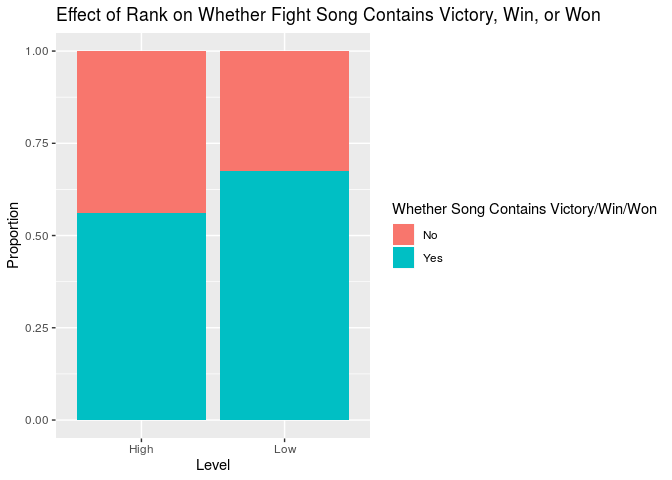<!-- -->

    ## # A tibble: 4 x 3
    ## # Groups:   rank_level [2]
    ##   victory_win_won rank_level rel_freq
    ##   <chr>           <chr>         <dbl>
    ## 1 No              High          0.44 
    ## 2 No              Low           0.325
    ## 3 Yes             High          0.56 
    ## 4 Yes             Low           0.675

Based on the output, 56% of high ranked teams and 67.5% of low ranked
teams include the words “victory”, “win”, or “won” in their fight songs.
This is an observed difference of -11.5% (in the order of high - low
rank).

The null hypothesis is that there is no difference in the proportion of
colleges that include the words “victory”, “win”, or “won” in their
fight songs based on high versus low rank; H0: p(high\_rank) -
p(low\_rank) = 0.

The alternative hypothesis is that there is a difference in the
proportion of colleges that include the words “victory”, “win”, or “won”
in their fight songs based on high versus low rank; Ha: p(high\_rank) -
p(low\_rank) ≠ 0.

Now, we will run a hypothesis test, calculate the p-value, and interpret
the results in order to determine whether there is a statistically
significant difference in the proportion of colleges that include the
words “victory”, “win”, or “won” in their fight songs based on high
versus low rank:

    ## # A tibble: 1 x 1
    ##   p_value
    ##     <dbl>
    ## 1   0.262

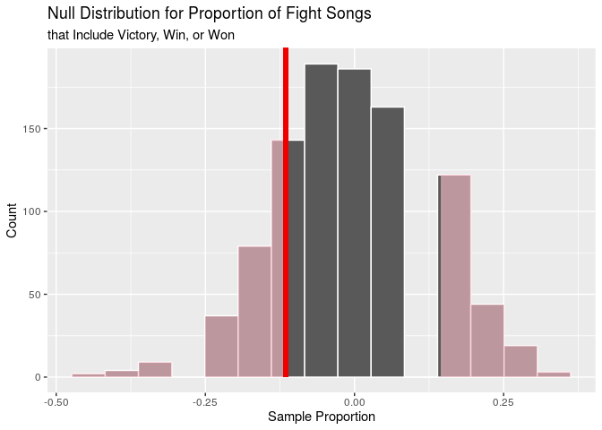<!-- -->

Since the p-value, 0.262, is greater than our significance level of
0.05, we fail to reject the null hypothesis in favor of the alternative
hypothesis. In other words, the data do not provide convincing evidence
of a difference in the proportion of colleges that include the words
“victory”, “win”, or “won” in their fight songs based on high versus
low rank. Thus, our original hypothesis was incorrect.

We also hypothesize that a statistically significant relationship exists
between `opponents` and `rank_level` since higher-ranked college
football teams are likely to have developed more emotionally-charged
rivalries with their highly successful peers. With such long-standing,
emotional rivalries, it is reasonable to believe fight songs associated
with these highly-ranked college football programs allude to their
rivals by name.

First, we will calculate and visualize the difference in proportions of
“yes” responses to `opponents` based on `rank_level`:

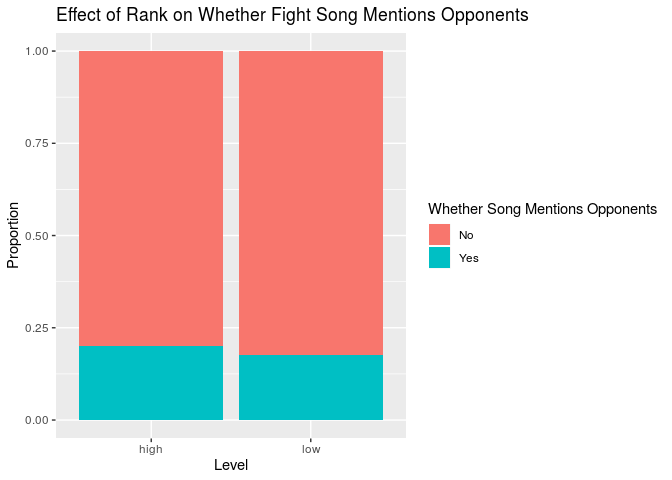<!-- -->

    ## # A tibble: 4 x 3
    ## # Groups:   rank_level [2]
    ##   opponents rank_level rel_freq
    ##   <chr>     <chr>         <dbl>
    ## 1 No        High          0.8  
    ## 2 No        Low           0.825
    ## 3 Yes       High          0.2  
    ## 4 Yes       Low           0.175

Based on the output, 20% of high ranked teams and 17.5% of low ranked
teams mention opponents in their fight songs. This is an observed
difference of 2.5% (in the order of high - low rank).

The null hypothesis is that there is no difference in the proportion of
colleges that mention opponents in their fight songs based on high
versus low rank; H0: p(high\_rank) - p(low\_rank) = 0.

The alternative hypothesis is that there is a difference in the
proportion of colleges that mention opponents in their fight songs based
on high versus low rank; Ha: p(high\_rank) - p(low\_rank) ≠ 0.

Now, we will run a hypothesis test, calculate the p-value, and interpret
the results in order to determine whether there is a statistically
significant difference in the proportion of colleges that mention
opponents in their fight songs based on high versus low rank:

    ## # A tibble: 1 x 1
    ##   p_value
    ##     <dbl>
    ## 1   0.958

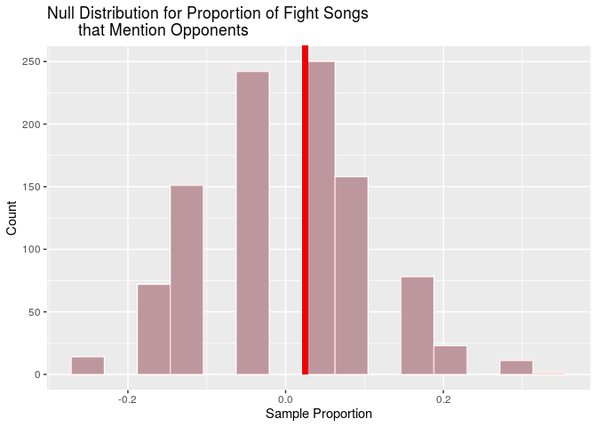<!-- -->

Since the p-value, 0.958, is greater than our alpha level of 0.05, we
fail to reject the null hypothesis in favor of the alternative
hypothesis. In other words, the data do not provide convincing evidence
of a difference in the proportion of colleges that mention opponents in
their fight songs based on high versus low rank. Thus, our original
hypothesis was incorrect.

Moreover, we hypothesize that a statistically significant relationship
exists between `nonsense` and `rank_level` because there have been a
plethora of articles written about how, in the past, highly successful
teams included nonsensical phrases in their fight songs to distract the
players on opposing college football teams. Since the fight songs
included in our dataset were written decades ago (as evidenced by the
`year` variable), it is reasonable to assume the songs associated with
the historically-best college teams will have a higher likelihood of
including nonsense (e.g “Hooperay”).

First, we will calculate and visualize the difference in proportions of
“yes” responses to `nonsense` based on `rank_level`:

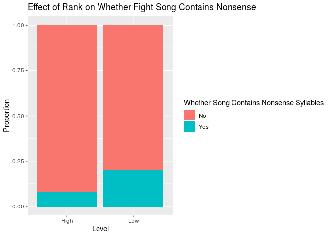<!-- -->

    ## # A tibble: 4 x 3
    ## # Groups:   rank_level [2]
    ##   nonsense rank_level rel_freq
    ##   <chr>    <chr>         <dbl>
    ## 1 No       High           0.92
    ## 2 No       Low            0.8 
    ## 3 Yes      High           0.08
    ## 4 Yes      Low            0.2

Based on the output, 8% of high ranked teams and 20% of low ranked teams
include nonsense words in their fight songs. This is an observed
difference of -12% (in the order of high - low rank).

The null hypothesis is that there is no difference in the proportion of
colleges that include nonsense in their fight songs based on high versus
low rank; H0: p(high\_rank) - p(low\_rank) = 0.

The alternative hypothesis is that there is a difference in the
proportion of colleges that include nonsense words in their fight songs
based on high versus low rank; Ha: p(high\_rank) - p(low\_rank) ≠ 0.

Now, we will run a hypothesis test, calculate the p-value, and interpret
the results in order to determine whether there is a statistically
significant difference in the proportion of colleges that include
nonsense words in their fight songs based on high versus low rank:

    ## # A tibble: 1 x 1
    ##   p_value
    ##     <dbl>
    ## 1    0.38

<!-- -->

Since the p-value, 0.38, is greater than our significance level of 0.05,
we fail to reject the null hypothesis in favor of the alternative
hypothesis. In other words, the data do not provide convincing evidence
of a difference in the proportion of colleges that include nonsense
words in their fight songs based on high versus low rank. Thus, our
original hypothesis was incorrect.

Finally, we hypothesize that there is no statistically significant
relationship between `rah` and `rank_level` since “rah” is a common word
in a fight song, seemingly irrespective of the success of a college
football team.

First, we will calculate and visualize the difference in proportions of
“yes” responses to `rah` based on `rank_level`.

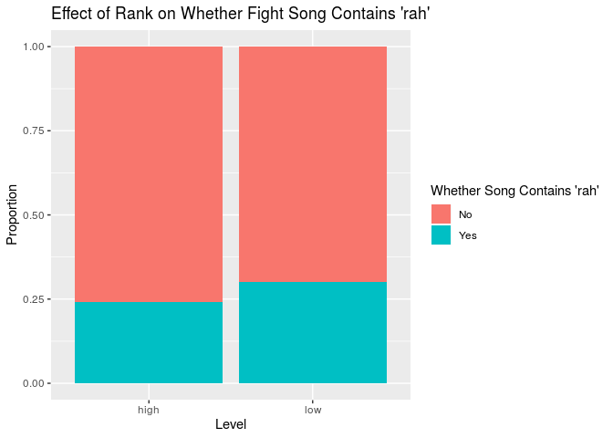<!-- -->

    ## # A tibble: 4 x 3
    ## # Groups:   rank_level [2]
    ##   rah   rank_level rel_freq
    ##   <chr> <chr>         <dbl>
    ## 1 No    High           0.76
    ## 2 No    Low            0.7 
    ## 3 Yes   High           0.24
    ## 4 Yes   Low            0.3

Based on the output, 24% of high ranked teams and 30% of low ranked
teams include the word “rah” in their fight songs. This is an observed
difference of -6% (in the order of high - low rank).

The null hypothesis is that there is no difference in the proportion of
colleges that include the word “rah” in their fight songs based on high
versus low rank; H0: p(high\_rank) - p(low\_rank) = 0.

The alternative hypothesis is that there is a difference in the
proportion of colleges that include the word “rah” in their fight songs
based on high versus low rank; Ha: p(high\_rank) - p(low\_rank) ≠ 0.

Now, we will run a hypothesis test, calculate the p-value, and interpret
the results in order to determine whether there is a statistically
significant difference in the proportion of colleges that include the
words “rah” in their fight songs based on high versus low rank:

    ## # A tibble: 1 x 1
    ##   p_value
    ##     <dbl>
    ## 1   0.752

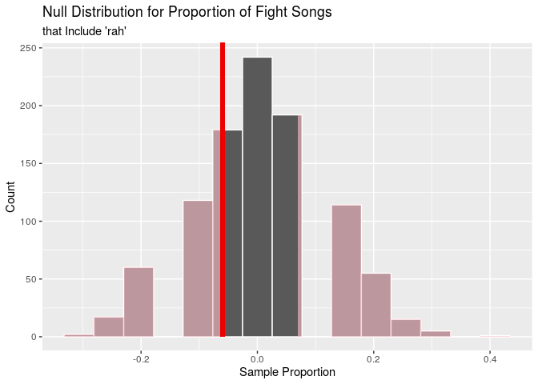<!-- -->

Since the p-value, 0.752, is greater than our significance level of
0.05, we fail to reject the null hypothesis in favor of the alternative
hypothesis. In other words, the data do not provide convincing evidence
of a difference in the proportion of colleges that include the word
“rah” in their fight songs based on high versus low rank. Thus, our
original hypothesis was correct.

Now, we will find the full linear model that predicts the rank of a
college football team (`rank`) based on various characteristics of the
college’s fight song: `victory_win_won`, `opponents`, `nonsense`, and
`rah` and calculate the R-squared value for this model:

    ## # A tibble: 5 x 2
    ##   term               estimate
    ##   <chr>                 <dbl>
    ## 1 (Intercept)           39.0 
    ## 2 victory_win_wonYes    -6.25
    ## 3 opponentsYes          -5.56
    ## 4 nonsenseYes           10.6 
    ## 5 rahYes                 6.80

    ## [1] 615.9821

    ## [1] 0.06228747

Based on the output, the full linear model is `rank-hat` = 39.0 - 6.25
\* `victory_win_wonYes` - 5.56 \* `opponentsYes` + 10.6 \*
`nonsenseYes`+ 6.80 \* `rahYes`. The R-squared value is 0.0622875;
therefore, approximately 6.2287474% of the variability in rank can be
accounted for by the model. Given this R-squared value, the model is
very weak and is not a great predictor of a college football team’s
ranking.

The intercept tells us that for a college with “No” responses for
`victory_win_won`, `opponents`, `nonsense`, and `rah`, the expected
ranking of the school’s football team is 39.0. The slope coefficient
associated with `victory_win_wonYes` tells us that if a fight song
includes the words “victory”, “win”, or “won”, the ranking of the
football team is expected, on average, to decrease by 6.25, holding all
else constant. The slope coefficient associated with `opponentsYes`
tells us that if a fight song mentions the college’s opponent, the
ranking of the football team is expected, on average, to decrease by
5.56, holding all else constant. The slope coefficient associated with
`nonsenseYes` tells us that if a fight song includes any nonsense words,
the ranking of the football team is expected, on average, to increase by
10.6, holding all else constant. The slope coefficient associated with
`rahYes` tells us that if a fight song includes the word “rah”, the
ranking of the football team is expected, on average, to increase by
6.80, holding all else constant.

To confirm that there is no better model, we will use the `step()`
function and backwards selection with AIC as the selection criterion:

    ## # A tibble: 1 x 2
    ##   term        estimate
    ##   <chr>          <dbl>
    ## 1 (Intercept)     37.6

    ## [1] 612.1624

Since backwards selection removed `victory_win_won`, `opponents`,
`nonsense`, and `rah` from our model, we should conclude that these four
variables are poor predictors for the ranking of a college football
team.

However, we must consider one last element before concluding that
`victory_win_won`, `opponents`, `nonsense`, and `rah` are poor
predictors of `rank`: whether the requirements for linear regression are
satisfied. Amongst other things, a linear model mandates a continuous
numerical response variable. However, `rank` does not fulfill this
criterion since it is a counting (discrete) numerical response variable.
Thus, we conclude that this method of analysis involving linear
regression is invalid and there is no guarantee that the explanatory
variables are poor predictors of the response variable.

### Conclusion from Research Question 2

Circling back to our research question of whether the characteristics of
college fight songs can help predict the historic success of their
football teams, we hypothesized that colleges whose fight songs included
the words “victory”, “win”, or “won”, mentioned oponents, and included
nonsense words would have higher ranked football teams. We thought that
higher ranked teams would include the words “victory”, “win”, and “won”
as symbolic elements of their dominance, mention opponents due to the
development of emotionally-charged rivalries, and yell nonsense words in
order to distract the players on opposing college football teams.
Additionally, we hypothesized that there was no relationship between
whether a college’s fight song included the word “rah” and their
football team’s success because “rah” is such a common word in fight
songs.

We decided to create a new variable called `rank_level` in order to
split the football teams into high and low rankings. After conducting
four hypothesis tests, it turned out that none of these fight song
characteristics resulted in statistically significant differences in
college football ranking. The p-values from the hypothesis tests were
0.262, 0.958, 0.38, and 0.752, indicating that there was no
statistically significant difference in `victory_win_won`, `opponents`,
`nonsense`, and `rah` based on `rank_level`.

Finally, we looked at the linear model between `victory_win_won`,
`opponents`, `nonsense`, and `rah`, the explanatory variables, and
`rank` to see whether these characteristics of fight songs were, indeed,
good predictors of a college football team’s success. This model had an
R-squared value of 0.0623, which indicated that it was very weak. We
then decided to use backwards selectection with AIC as the criterion to
see if there was a better linear model. However, backwards selection
removed all four of our explanatory variables, which indicated to us
that these characteristics are not valid predictors for a college
football team’s rank. Therefore, the answer to our research question is
that `victory_win_won`, `opponents`, `nonsense`, nor `rah` can predict
the success of a college football
team.

## Additional Analysis: Looking at Characteristics in Fight Songs in Northern and Southern Athletic Conferences

For the last part of our analysis, we are interested in examining
whether certain characteristics of fight songs are regionally unique. In
particular, we are interested in looking at the variables
`victory_win_won`, whether a song includes the words “victory”, “win”,
or "won, `men`, whether a song refers to male groups (fathers, sons,
men, etc.), and `nonsense`, whether a song uses nonsense syllables, to
see whether northern schools (conferences) are more or less likely to
have fight songs with these characteristics.

First, we will add a new variable to the `fight_songs` dataset called
`region`, which will represent the region of the United States that a
given college is located based on its conference – north or south. Since
Notre Dame is the only college we will consider in the analysis that is
independent (not in a conference), we will encode it to a region on its
own (north). It should also be noted that the PAC-12 and ACC conferences
are considered western and eastern conferences, respectively, but for
the purpose of our analysis, we will label them as northern and
southern, respectively, because we are interested in the characteristics
of fight songs for conferences in the north vs. south. Exactly half of
the teams in the PAC-12 conference are, indeed, northern schools, while
the majority of schools in the ACC conference are southern.

    ## # A tibble: 2 x 2
    ##   region     n
    ##   <chr>  <int>
    ## 1 north     27
    ## 2 south     38

There are 27 schools that we are considering to be in the northern
region and 38 in the southern region.

We will look at our first variable, `victory_win_won` to see whether
there exists a statistically significant relationship between the
proportion of teams for which `victory_win_won` is “yes” for northern or
southern conferences. First, we will find what the two proportions are.

    ## # A tibble: 4 x 4
    ## # Groups:   region [2]
    ##   region victory_win_won     n prop_victory_win_won_yes
    ##   <chr>  <chr>           <int>                    <dbl>
    ## 1 north  No                  8                    0.296
    ## 2 north  Yes                19                    0.704
    ## 3 south  No                 16                    0.421
    ## 4 south  Yes                22                    0.579

Based on the output, 70.4% of schools in northern conferences have the
words “victory,” “win,” or “won” in their fight songs. On the other
hand, only 57.9% of schools in southern conferences have the words
“victory,” “win,” or “won” in their fight songs. Below, we will
visualize these percentages in a segmented bar
plot.

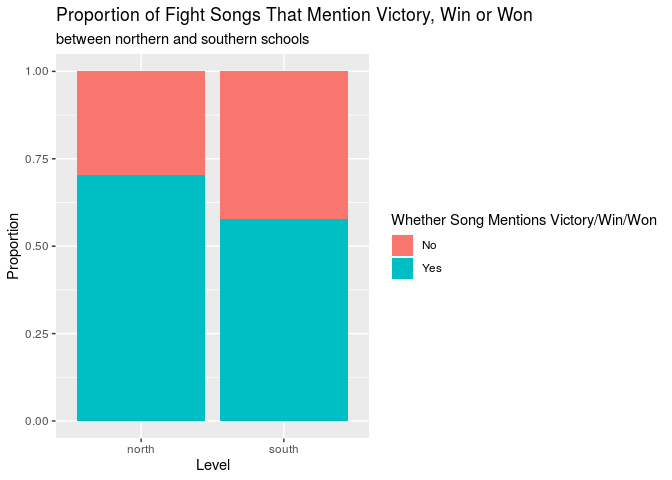<!-- -->

We would like to see if this result is statistically significant and
what the true difference in proportions is. We have to use
simulation-based hypothesis testing because we are looking for the
difference in proportions.

First, we will run a hypothesis test, calculate the p-value, and
interpret the results in order to determine whether there is a
statistically significant difference in the proportion of fight songs
that say “victory,” “win,” or “won” for schools in northern vs. southern
conferences. Our null hypothesis is that there is no difference in the
proportion of schools that say “victory,” “win,” or “won” in their fight
songs for southern and northern conferences, H0: p(southern) =
p(northern). Our alternative hypothesis is that there is a difference in
the proportion of schools that say “victory,” “win,” or “won” in their
fight songs for southern and northern conferences, Ha: p(southern) ≠
p(northern). We will use a significance level of 0.05.

    ## # A tibble: 1 x 1
    ##   p_value
    ##     <dbl>
    ## 1   0.418

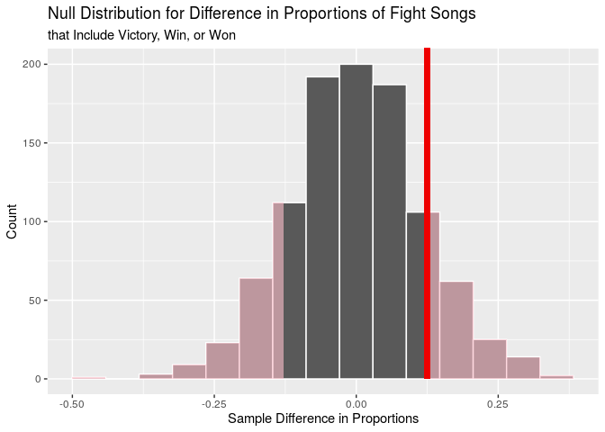<!-- -->

Based on our p-value of 0.418, which is greater than our significance
level of 0.05, we fail to reject the null hypothesis. There is
insufficient evidence that there is a difference in the proportion of
fight songs that include “victory,” “win,” or “won” for southern and
northern conferences.

Next, we will look at our second variable, `men`, which refers to
whether a fight song mentions male groups in its lyrics, to see whether
there exists a statistically significant relationship between the
proportion of teams for which `men` is “yes” for northern or southern
conferences. First, we will find what the two proportions are:

    ## # A tibble: 4 x 4
    ## # Groups:   region [2]
    ##   region men       n prop_men
    ##   <chr>  <chr> <int>    <dbl>
    ## 1 north  No       15    0.556
    ## 2 north  Yes      12    0.444
    ## 3 south  No       26    0.684
    ## 4 south  Yes      12    0.316

Based on the output, 44.4% of schools in northern conferences mention
male groups in their fight songs. On the other hand, only 31.6% of
schools in southern conferences mention male groups in their fight
songs. Below, we will visualize these percentages in a segmented bar
chart.

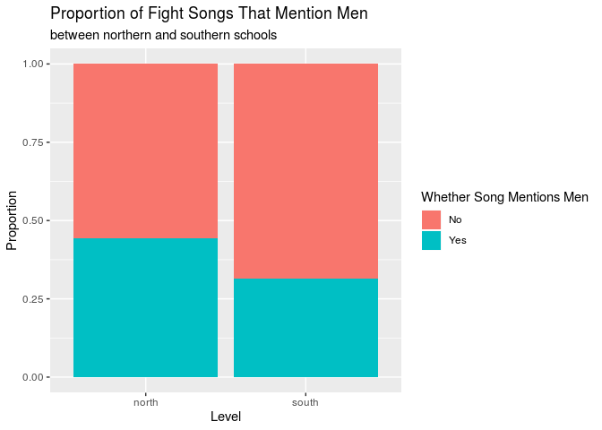<!-- -->

We would like to see if this result is statistically significant and
what the true difference in proportions is. We have to use
simulation-based hypothesis testing because we are looking for the
difference in proportions.

First, we will run a hypothesis test, calculate the p-value, and
interpret the results in order to determine whether there is a
statistically significant difference in the proportion of fight songs
that mention male groups for schools in northern vs. southern
conferences. Our null hypothesis is that there is no difference in the
proportion of schools that mention men in their fight songs for southern
and northern conferences, H0: p(southern) = p(northern). Our alternative
hypothesis is that there is a difference in the proportion of schools
that mention men in their fight songs for southern and northern
conferences, Ha: p(southern) ≠ p(northern). We will use a significance
level of 0.05.

    ## # A tibble: 1 x 1
    ##   p_value
    ##     <dbl>
    ## 1   0.454

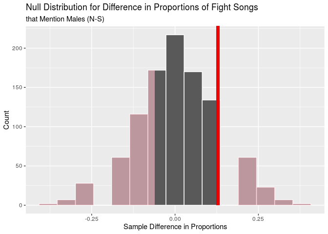<!-- -->

Based on our p-value of 0.454, which is greater than our significance
level of 0.05, we fail to reject the null hypothesis. There is
insufficient evidence that there is a difference in the proportion of
fight songs that mention male groups for southern and northern
conferences.

Finally, we will look at our last variable, `nonsense`, which refers to
whether a fight song uses nonsense syllables in its lyrics, to see
whether there exists a statistically significant relationship between
the proportion of teams for which `nonsense` is “yes” for northern or
southern conferences. First, we will find what the two proportions are:

    ## # A tibble: 4 x 4
    ## # Groups:   region [2]
    ##   region nonsense     n prop_nonsense
    ##   <chr>  <chr>    <int>         <dbl>
    ## 1 north  No          23         0.852
    ## 2 north  Yes          4         0.148
    ## 3 south  No          32         0.842
    ## 4 south  Yes          6         0.158

Based on the output, 14.8% of schools in northern conferences use
nonsense syllables in their fight songs. On the other hand, 15.8% of
schools in southern conferences use nonsense syllables in their fight
songs. Below, we will visualize these percentages in a segmented bar
chart.

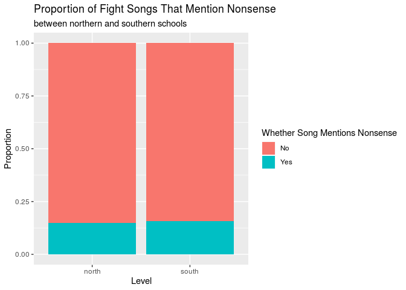<!-- -->

We would like to see if this result is statistically significant and
what the true difference in proportions is. We have to use
simulation-based hypothesis testing because we are looking for the
difference in proportions.

First, we will run a hypothesis test, calculate the p-value, and
interpret the results in order to determine whether there is a
statistically significant difference in the proportion of fight songs
that use nonsense syllables for schools in northern vs. southern
conferences. Our null hypothesis is that there is no difference in the
proportion of schools that use nonsense syllables in their fight songs
for southern and northern conferences, H0: p(southern) = p(northern).
Our alternative hypothesis is that there is a difference in the
proportion of schools that mention men in their fight songs for southern
and northern conferences, Ha: p(southern) ≠ p(northern). We will use a
significance level of 0.05.

    ## # A tibble: 1 x 1
    ##   p_value
    ##     <dbl>
    ## 1   0.648

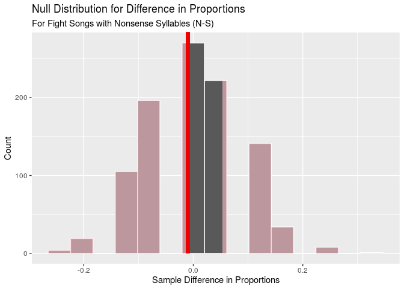<!-- -->

Based on our p-value of 0.648, which is greater than our significance
level of 0.05, we fail to reject the null hypothesis. There is
insufficient evidence that there is a difference in the proportion of
fight songs that use nonsense syllables for southern and northern
conferences.

### Conclusion from Additional Analysis

We hypothesized that characteristics of fight songs would vary depending
on whether a fight song is from a team in a southern vs. northern
athletic conference. We decided to look at the variables
`victory_win_won`, `men`, and `nonsense` because we thought that, out of
all of the variables in our dataset, these three might vary based on
geographical location.

However, based on the hypothesis testing above, it turns out that the
variables `victory_win_won` (p = 0.418), `men` (p = 0.454), and
`nonsense` (p = 0.648) are NOT regionally unique. In other words,
knowing whether a school is in a southern vs. northern conference does
not tell us whether that school’s fight song is more or less likely to
include the words “victory”, “win”, or “won”, mention male
individuals/groups, or use nonsense words/phrases. The data leads us to
believe that college fight songs are truly independent and random from
one another.

### Overall Conclusions

The research questions we analyzed in this project were: (1) how the
tempo and duration of college football fight songs affect the number of
tropes?; (2) how the specific attributes of fights songs correlate with
the historical rankings of college football programs in the United
States? With hypothesis testing as our primary tool, we determined tempo
and duration are NOT useful in predicting the content of college fight
songs (number of tropes). Moreover, we determined that the presence of
nonsense syllables, victory/win/won, references to male
groups/individuals, and references to opponents are not related to the
historical success of college football teams.

Of course, our analysis (and hence resulting conclusions) has serious
limitations due to the composition of the dataset. Our dataset only
included 65 teams, so, when we elected to divide the teams into
region-dependent or tempo and duration-based categories, the Central
Limit Theorem no longer proved valid (at least 30 observations
necessary). This compelled us to use simulation-based hypothesis testing
with relatively small sample sizes (decreasing the reliability of the
results). Additionally, as our Markdown file is so long, we were unable
to perform more than 1000 simulations for each hypothesis test (ideally,
we would have performed 15000 simulations) and still successfully knit
the file. Another consequence of the small number of observations was
invalidating hypothesis testing for slopes. Determinining whether the
slope coefficients from our linear models were truly significant would
be particularly useful in our analysis; however, one of the conditions
of inference for regression – constant variance – was violated.

If we were to redo this project, we would definitely think heavily about
adding observations to our `fight-songs` dataset. Currently, the dataset
originally included fight songs from 65 college football teams; however,
in future analyses, we would use web scraping to gain information about
all 130 Division I college football teams in the United States. This
could dramatically improve our analysis because, with more observations
in consideration, certain statistical methods which we were forced to
reject, including hypothesis testing for the slope coefficients, might
become valid (variance may be constant).

Moreover, as we briefly mentioned earlier, the dataset compiled by
`fivethirtyeight` does not include certain verses from traditional fight
songs. Rather, our analysis concentrated on the official versions of
these songs, published by the respective colleges. Therefore, the trope
count for each song is not entirely accurate as some of the missing
lyrics undoubtedly contained references to male groups or opponents,
nonsense syllables, “victory”/“win”/“won”, “rah”, etc. (presenting
another limiting factor). Thus, not only did we examine a small sample
population of fight songs, but we also only considered abbreviated song
lyrics.

Furthermore, we would definitely consider the possibility of a
confounding variable more seriously in future analyses because, based on
the overall conclusions, there are two main possibilities: either there
truly is no significant relationship between the explanatory and
response variables (in which case, adding more observations will not
change the conclusion), or there is a hidden significant relationship
between the explanatory and response variables (in which case, adding
more observations may affect the conclusion)\!
